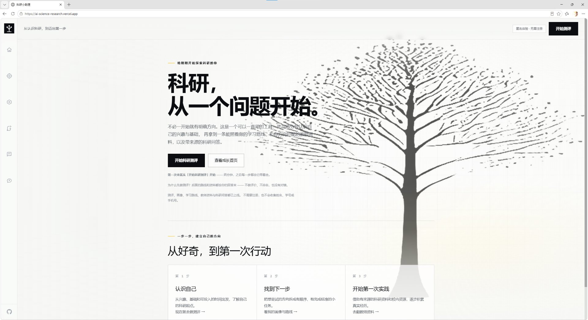

# 科研小助理 · AI Science Research

> 粤港澳大湾区 AI Coding 创新大赛 · 赛题方向二 **「AI + 学术科研助手」**
> 深圳大学 · 计算机与软件学院 · 3 人参赛队

面向**大一新生**的科研启蒙助手：不用注册，做一次测评拿到自己的科研画像，
按画像生成一条可以打勾的学习路线，再从**带来源的**校内教师资料与科研问答里找到下一步。

```
免注册进入 → 科研测评 → 科研画像 → 学习路线 → 兴趣匹配资料 → 科研问答 → 任务打勾 → 刷新仍在
```

**内容原则：只说有来源的话。** 资料里没有的必须明说「无法确认」，不编造听起来合理的回答。

| | |
|---|---|
| 在线体验 | <https://ai-science-research.vercel.app> ⚠️ 默认域名在中国大陆需代理访问，原因与备选做法见 [`docs/黄瑜/部署与线上验证记录.md`](docs/黄瑜/部署与线上验证记录.md) |
| 产品需求文档 | [`docs/傅加贝/科研小助理产品需求文档PRD.md`](docs/傅加贝/科研小助理产品需求文档PRD.md) |
| 开发协作规则 | [`CONTRIBUTING.md`](CONTRIBUTING.md) |
| 文档总索引 | [`docs/总控文档.md`](docs/总控文档.md) |

---

## 界面预览



首页：从「科研，从一个问题开始」进入，往下是「从好奇，到第一次行动」的三步流程卡。
截图取自线上版本（浏览器地址栏即 <https://ai-science-research.vercel.app>）。

---

## 快速开始

需要 **Node.js 24.x** 与 **pnpm 11.19.0**。

```bash
pnpm install --frozen-lockfile
pnpm dev                 # http://localhost:3000
```

**不需要任何密钥即可启动** —— 未配置数据库时自动使用不持久化的内存实现，配置后切换到 CloudBase PostgreSQL。
Windows 也可以直接双击 [`run-dev.bat`](run-dev.bat)。

```bash
pnpm check               # ESLint（--max-warnings=0）+ 类型检查 + 生产构建
pnpm test                # 单元测试（Node 自带测试运行器，无额外依赖）
pnpm start               # 构建成功后本地启动生产版本
```

配置模板见 [`.env.example`](.env.example)，真实值只放 `.env.local` 或部署平台的环境变量 —— **本仓库是 Public，密钥绝不入库**。

### 验证脚本

```bash
# 数据库层：约束、upsert 语义、错误码映射、类型往返（针对真实 CloudBase PostgreSQL，自清理）
node --env-file=.env.local scripts/verify/database-layer.mjs

# 应用层：真实 Cookie 往返、状态码，以及两个会话互相看不到对方的进度
pnpm build && pnpm start        # 另开终端
node --env-file=.env.local scripts/verify/identity-isolation.mjs [baseUrl]
```

---

## 功能一览

### 页面（7 个 + 全局状态页）

| 路由 | 做什么 |
|---|---|
| `/` | 首页：产品定位 + 两个入口（开始测评 / 成长首页）+ 三步流程卡 |
| `/assessment` | 科研认知测评：题库 15 题（9 核心 + 6 深入），一次一题、自适应出题，可回退改答、可展开「为什么问这一题」 |
| `/profile` | 科研画像：阶段 + 状态总结、优势 / 待补能力两栏对照、兴趣标签、3 条优先行动、**画像依据** |
| `/roadmap` | 学习路线：3 个阶段、6～8 项任务，每项带预计耗时与完成标准；4 种任务状态 + 备注 |
| `/dashboard` | 成长首页：下一步 / 路线进度 / 最近完成 / 兴趣方向 / 推荐资料；无画像时是引导空状态，不摆假数据 |
| `/resources` | 教师资料：搜索、方向筛选、「只看明确欢迎本科生」开关；卡片可展开**来源**（标题 + 链接 + 核验日期） |
| `/questions` | 科研问答：12 条 FAQ 快捷入口；回答带**证据覆盖度**与**来源**两个角标，另有「下一步可以做的事」与「这条回答的边界」 |

另有 `error.tsx` / `loading.tsx` / `not-found.tsx` 三个全局状态页。

### 服务端接口（5 个）

| 接口 | 作用 |
|---|---|
| `GET /api/ping` | 自检：应用是否就绪、数据库与 AI 的**配置**是否到位（不发起付费调用） |
| `GET\|POST /api/session` | 匿名会话，Cookie 为 HttpOnly，服务端只存摘要；无会话返回 401，不隐式创建 |
| `POST /api/assessment/next` | 出下一题；必带会话，否则 401 |
| `GET\|POST /api/progress` | 读 / 写任务进度；身份只认服务端会话，请求体带他人 `userId` → 403 |
| `POST /api/questions` | 科研问答；必带会话 |

统一返回 `ApiResponse<T>`（`{ ok: true, data }` / `{ ok: false, error: { code, message, requestId } }`），
错误码用业务枚举（`BAD_REQUEST` / `UNAUTHORIZED` / `FORBIDDEN` / `NOT_FOUND` / `CONFLICT` / `TIMEOUT` / `UPSTREAM_UNAVAILABLE` / `INTERNAL`），
不透传数据库错误码 —— 网关返回的 `message` 会带出表名、列名与约束名。

### 数据资产

| 文件 | 内容 |
|---|---|
| `data/szu-teachers.json` | 10 位计算机与软件学院教师：院系、研究中心、职称、研究方向、公开邮箱、**来源**、招募状态、代表性成果 |
| `data/research-faq.json` | 12 条 FAQ + 7 条来源：问题、触发词、分类、回答、行动、来源、边界、核验日期 |

加载时经 `validateDataset()` 校验并**深冻结**；资料不合格直接抛错，不会静默降级成空目录。
所有来源都带 `url` / `publisher` / `evidenceSummary` / `checkedAt` / `pageUpdatedAt` / `verification`。

### AI 的两处用法（都带降级）

| 用途 | 参与什么 | 不参与什么 | 失败时 |
|---|---|---|---|
| **测评出题** | 从候选题目里挑下一题并写一句衔接 | **完全不参与打分** | 退回规则出题，界面明说「当前用基础模式出题」 |
| **问答组织** | 依据筛好的证据组织语言 | 不决定引用（引用由来源注册表还原） | 回落规则回答，角标如实显示「规则回答」 |

> **为什么模型不打分**：PRD 要求评分可解释、可复现。交给模型会让同一份答案在两次运行里得出不同结论，
> 也无法向学生解释。维度得分、阶段判定、画像生成全部由 `src/features/assessment` 里的**确定性纯函数**完成。

---

## 技术方案

| 项 | 选型 |
|---|---|
| 框架 | Next.js 16.3.5（App Router）+ React 19.3 |
| 语言 | TypeScript 5.9（`strict`） |
| 样式 | Tailwind CSS 4.3 + 手写 `globals.css`（浅色黑白工业风，直角、无辉光） |
| 数据库 | CloudBase PostgreSQL（PostgREST 接入），未配置时内存实现 |
| AI | `@tencent-ai/agent-sdk`（服务端调用，`allowedTools: []` + `maxTurns: 1`） |
| 测试 | Node 内置 `node --test`，**不引入测试框架** |
| CI | GitHub Actions：`frozen-lockfile → pnpm test → pnpm check` |

### 项目结构

```
src/
├─ app/             # App Router：7 个页面 + 5 个 API 路由 + 全局状态页 + globals.css
├─ components/      # 全局骨架：app-shell / nav-items / site-header / logo
├─ contracts/       # 公共契约（类型即接口），samples.ts 受 tsc 编译校验
├─ features/        # 业务模块，纯规则与交互组件同目录
│  ├─ assessment/   # 题库、自适应出题、评分（纯函数 + *.test.ts）
│  ├─ profile/ · roadmap/ · guidance/   # 画像、路线、维度引导
│  ├─ questions/    # 规则引擎、证据筛选、AI 组织回答、请求编排
│  ├─ resources/    # 资料目录、教师检索、数据集校验
│  ├─ progress/     # 进度客户端
│  ├─ dashboard/    # 成长首页视图
│  └─ shared/       # api-client、本地桥接与会话
└─ server/          # 只跑在服务端（server-only）
   ├─ ai/           # SDK 适配器 + 测评教练 / 问答组织
   ├─ auth/         # 匿名会话与 Cookie
   ├─ repositories/ # 数据访问接口 + 内存实现 + PostgREST 实现
   ├─ resources/    # 数据集加载、问答 provider
   └─ services/     # api-response、health、identity、progress

data/               # 公开资料 JSON（教师、FAQ）
docs/               # 团队文档：PRD、实测记录、规范建议
scripts/
├─ migrations/      # 人写的 SQL 源文件（序号制）
└─ verify/          # 数据库层 / 身份隔离的验收脚本
cloudbase/migrations/   # 实际投递记录（14 位时间戳）
赛事手册/            # 赛事原始材料
```

### 几个刻意的设计取舍

**① 契约先行。** 三人按 `src/contracts/` 里的类型并行开工，不必等整个数据库设计定下来。
`samples.ts` 是完整的最小样例，**并且会被 `tsc` 检查** —— 类型改了样例没改就编译失败，所以它不会和类型脱节。
三条铁律：

1. **身份只能由服务端确认。** 任何接口收到请求体里的 `userId` 都必须忽略。
   我们的 API Key 带 `bypassrls`，**数据库层的行级权限对我们无效**，只有应用层的归属过滤能挡住越权。
2. **契约层只放可序列化数据。** 不放类实例、函数、`Date`、`Map`/`Set`；ESLint 禁止 `src/contracts/**` 导入 `@/server/**`。
3. **演示数据必须显式标记**（`isDemo` / `accountType: "demo"`），不得与真实记录混在一起。

**② 外部依赖走适配器层。** 数据访问的接口在 `src/server/repositories/types.ts`，实例由 `index.ts` 导出 ——
从内存实现换成 PostgREST 实现只改 `index.ts` 一处，接口与调用方都不用动。
所有用户数据方法的第一个参数必须是 `userId`，接口层面就不给「不带归属的查询」留入口。

**③ 降级永远可用。** 没配密钥、超时、返回非法题号，一律退回规则实现，用户不会因为模型挂了而卡住。
AI 调用次数的开关（`SERVER_AI_STEP_MODE`）**不是优化项，而是可用性前提** —— 见下节。

**④ 测试不引框架。** `pnpm test` 用 Node 自带的测试运行器直接跑 TypeScript 源码，
所以被测模块之间的运行时导入必须写**相对路径 + 显式 `.ts` 扩展名**（`tsconfig` 为此开了 `allowImportingTsExtensions`）；
`@/contracts` 别名只用于 `import type`。隔离验证与浏览器端走查的做法见 [`docs/项目测试五层法.md`](docs/项目测试五层法.md)。

---

## 环境变量

**名字必须带 `SERVER_` 前缀**，值只放 `.env.local` 或部署平台。全部可选 —— 不配也能跑，只是能力受限。

| 变量 | 必需 | 说明 |
|---|---|---|
| `SERVER_CLOUDBASE_PG_REST_BASE_URL` | 数据库接入时 | PostgREST 基础地址；缺任一项即退回内存实现 |
| `SERVER_CLOUDBASE_PG_API_KEY` | 数据库接入时 | 同上。⚠️ **名字写错不会报错**，只会静默退回内存实现 |
| `SERVER_CODEBUDDY_API_KEY` | 用 AI 时 | 服务端专用，绝不进浏览器、日志或错误信息 |
| `SERVER_AI_STEP_MODE` | 否 | `checkpoints`（默认，每答完 3 题交给模型）/ `every` / `off`。**第一题永远走规则** |
| `SERVER_AI_TIMEOUT_MS` | 否 | 单次模型调用超时，默认 60000。设太小会被截断并**静默降级**且不报错；问答链路另有 120 秒下限 |
| `SERVER_AI_QA_MODE` | 否 | 问答链路的模型开关，`off` 时全部走规则回答。**这是一个「关得掉」的开关**：AI 走个人额度，接口挂在公开站点上，演示前需要能不改代码立刻停掉 |
| `SERVER_AI_DEBUG` | 否 | 设为 1 时把模型错误详情打进服务端日志（密钥本身永不记录） |

判断当前实例真的接上了什么，看 `GET /api/ping` —— 它会分别报告 database 与 ai 的状态。

---

## 已知限制与设计取舍

写在前面，免得被当成 bug：

- **AI 调用有 13～15 秒的固定冷启动开销**（SDK 每次都会起一个完整 agent 运行时），与提问长短无关。
  所以默认不是每题都调模型：一场 8 题的测评只有 **2 次**等待，每次约 10 秒（生产实测：测评出题 9.94 / 10.29 / 11.08 秒，问答 15～32 秒）。
- **模型约 1/3 概率返回空内容**（`code=empty`），系统会静默降级为规则回答并如实显示角标 —— 这不是页面卡住。
- **`*.vercel.app` 在中国大陆需代理访问**。本轮已决定不购买自定义域名；演示材料里标注代理需求，Demo 视频覆盖线上效果。
- **匿名会话，没有账号体系**：身份是一个 HttpOnly Cookie（30 天），换浏览器即换人。
- **画像与路线仍走浏览器本地存储**：数据库目前只有 `sessions` 与 `task_progress` 两张表，
  唯一要求落库的用户数据是**任务进度**；画像 / 路线的持久化是过渡方案。
- **实验室资料未做**，首批带来源的资料只有导师（10 位，全部带来源与核验日期）。
- **不做**：论文代写、导师评价与人品排名、科研成果展示、社交。

---

## 文档索引

`docs/` 里的文档分两类：**实测事实**（不随讨论变动，要改先拿出新的实测结果）与**随开发演进**（直接改）。

| 文档 | 管什么 |
|---|---|
| [总控文档](docs/总控文档.md) | 团队协作入口与索引 —— 该看哪份文档、怎么和 AI agent 配合、改动怎么提交 |
| [科研小助理产品需求文档 PRD](docs/傅加贝/科研小助理产品需求文档PRD.md) | 产品要做什么、已实现什么、待优化哪里 |
| [部署与线上验证记录](docs/黄瑜/部署与线上验证记录.md) | 线上在哪、怎么部署、验证结果、大陆可达性 |
| [数据库接入探针记录](docs/黄瑜/数据库接入探针记录.md) | 数据访问的硬约束：接入姿势、权限真相、错误形态 |
| [数据库交接说明](docs/黄瑜/数据库交接说明.md) | 数据库怎么接、建表流程、踩坑 |
| [云开发实测记录](docs/黄瑜/云开发实测记录.md) | CloudBase 环境的实测事实与限制 |
| [技术经验与开发规范建议](docs/黄瑜/技术经验与开发规范建议.md) | 工程方法论：探针制度、错误可见性、提交前检查清单 |
| [工程起步与分工路线](docs/工程起步与分工路线.md) | 工程边界、建议分工与开发顺序 |
| [项目测试五层法](docs/项目测试五层法.md) | 从单测到浏览器走查的五层验证清单 |
| [前端 UI 重构说明](docs/前端UI重构说明.md) | 视觉规范与布局约束 |
| [C 模块 Demo 复测与下一轮交付](docs/C模块Demo复测与下一轮交付.md) | 可信资料 / 科研问答模块的复测结论 |
| [赛事手册](赛事手册/) | 赛事规则、手册原文、官方口径 |

模块内部还有几份就近说明：[`src/contracts/README.md`](src/contracts/README.md)（契约逐字段速查）、
[`src/features/README.md`](src/features/README.md)、[`src/server/ai/README.md`](src/server/ai/README.md)（AI 接入与性能实测）、
[`src/server/repositories/README.md`](src/server/repositories/README.md)（数据访问的三条约束）、
[`scripts/migrations/README.md`](scripts/migrations/README.md)（迁移源文件与投递记录的关系）。

---

## 团队

深圳大学 · 计算机与软件学院 · 3 人

| 成员 | GitHub | 负责模块 |
|---|---|---|
| Kevin | [@Kevin87654](https://github.com/Kevin87654) | 公共工程、匿名身份、数据接入、部署 |
| waixr016 | [@waixr016](https://github.com/waixr016) | 测评、画像、路线、任务交互、成长首页、前端 UI |
| fodenspider | [@fodenspider](https://github.com/fodenspider) | 可信资料、科研问答、AI 适配 |

分工的详细边界见 [`docs/工程起步与分工路线.md`](docs/工程起步与分工路线.md)。

## 开源协议

[MIT](LICENSE)
