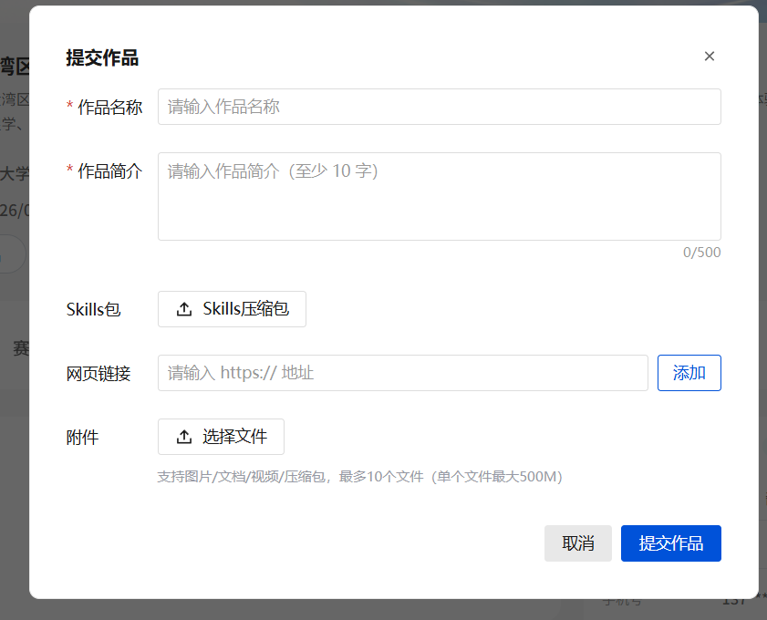

# 赛事群答疑记录

> 来源：赛事群聊天记录摘录 ｜ 整理于 2026-09-18 ｜ 精简于 2026-09-19
>
> **整理方式**：原始记录是无序群聊，已去除全部个人昵称与账号 ID，略去寒暄与平台操作细节，按主题重排。
> 原始记录**没有发言人标注**，统一记为「老师」（答复方）与「同学」（提问方）。
>
> ⚠️ **本文件是群内沟通的整理稿，不是官方文件。** 涉及赛事规则，以《赛事手册》与组委会正式通知为准。
> **只收录有明确结论的内容** —— 无结论的讨论、已过期的通知、手册已有的原文一律不收。
>
> **背景（手册原文）**：作品须部署至浏览器环境并提供可直接访问的在线链接；须提交完整源代码仓库（GitHub / Gitee）；须提交 LearnBuddy 历史对话记录作为评审参考。

---

## 一、作品提交与形态

### Q1 在线体验链接必须用"服务器 + 域名"吗？

**同学**：要提供可在线体验的链接。是必须使用服务器加域名的方式，还是只要点开这个链接能看到项目能交互就行？

**老师**：有链接就可以了，可以用 Vercel，其他的也可以。

### Q9 初赛的作品形态是什么？

**老师**：**初赛的作品形态是提交 demo 即可，不用部署到正式环境。** 在 LearnBuddy 上面搭建的智能体可以有多种形式，可以是 web demo，也可以是专家智能体，这些智能体做完之后是可以跟它进行交互体验使用的。

---

## 二、平台与工具限定

### Q2 可以自行配置模型吗？

**老师**：可以的。

### Q3 用 CodeBuddy CLI，对话记录怎么保存和提交？

**老师**：CLI 也有记录的。

### Q4 除 LearnBuddy 外，可以用 codex / cursor 等其他模型辅助吗？

**同学**：除了 LearnBuddy 以外，我们可以结合别的模型辅助完成项目吗？比如 codex 或者 cursor。

**老师**：我们是限定 LearnBuddy 作为指定比赛平台哦。

### Q10 LearnBuddy 自带的专家可以使用吗？

**老师**：可以。

---

## 三、选题

### Q5 题目怎么选？同时满足多个选题可以吗？

**老师**：是 9 选 1。9 个题目任选其一，多出的可以作为额外功能。

> 注：「9 选 1」的提问原文未包含在本摘录中；后半句是答复"同时满足多个选题可以吗"。

---

## 四、运行时 AI 与平台 API

### Q6 最终 Web 应用运行时，允许调用团队自有的第三方模型 API 吗？

**同学**（方向一「多模态教学智能体」）：我们会按要求使用 LearnBuddy 进行项目开发，并提交真实使用记录。最终 Web 应用在运行时，是否允许调用团队自有的第三方模型 API，例如 DeepSeek，来完成教学问答和图片理解？

**老师**：本次赛事以腾讯 LearnBuddy 平台为载体，**最终效果呈现时最好不要包含第三方 AI**。

> ⚠️ 这是答复**方向一**提问时的口径，注意适用语境。

### Q7 平台有没有开放给网页的 API？

**老师**：**平台本身没有开放给网页的 API。**

### Q8 那项目的图文解析该如何完成？

**同学**：LearnBuddy 没有可调用的 API，也不允许调用第三方 API，我们的项目图文解析该如何完成？

> ⚠️ **本问题当时未获答复。** 即：官方说明了限制，但未给出替代路径。

---

## 附：平台「提交作品」表单（截图）

表单可见字段：

| 字段 | 说明 | 是否标必填 |
|---|---|---|
| 作品名称 | 文本 | 是 |
| 作品简介 | 文本，至少 10 字，上限 500 字 | 是 |
| **Skills 包** | 上传 Skills 压缩包 | 未标记 |
| **网页链接** | 需填 `https://` 地址 | 未标记 |
| 附件 | 图片 / 文档 / 视频 / 压缩包，最多 10 个文件，**单个文件最大 500 MB** | 未标记 |

> 截图仅覆盖弹窗内的字段，不代表表单全部内容。
